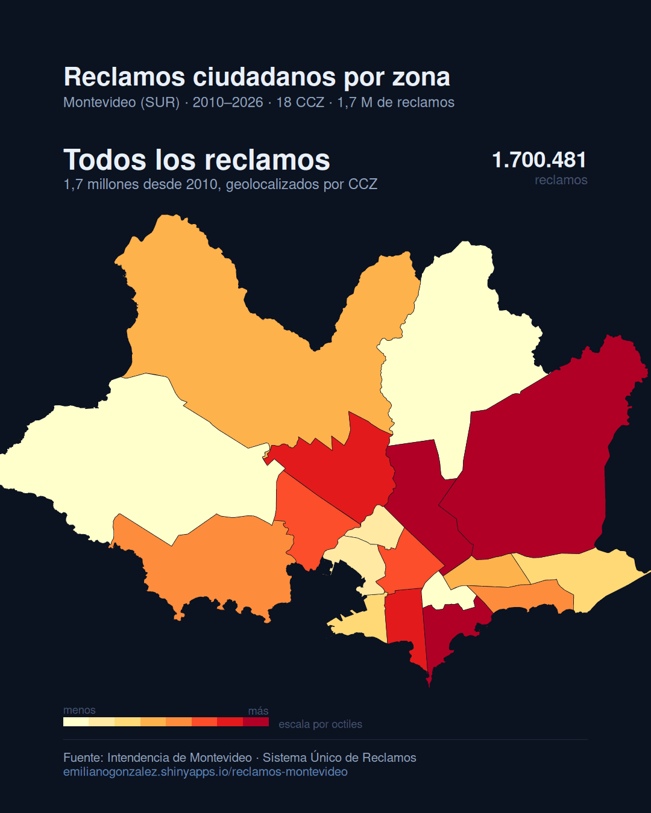

# reclamos-montevideo

App Shiny para explorar los **reclamos ciudadanos ante la Intendencia de Montevideo**,
con datos oficiales del **Sistema Único de Reclamos (SUR)**. 1,7 millones de
reclamos, de 2010 al último mes cerrado.

🔗 **App en vivo:** https://emilianogonzalez.shinyapps.io/reclamos-montevideo/



## Qué hay en los datos

Cada reclamo trae fecha de ingreso, estado actual (Ingresado / En Proceso /
Finalizado / Anulado), una clasificación en tres niveles (área > grupo > tipo
de problema) y coordenadas. Esta app le suma la geometría oficial de **18
Centros Comunales Zonales** y **8 Municipios** (intgis.montevideo.gub.uy), que
la fuente no trae: sólo publica lat/lon, sin decir a qué zona administrativa
pertenece cada reclamo. Se lo asigna por unión espacial punto-en-polígono.

## Una advertencia antes de mirar el mapa

**Un reclamo mide comportamiento de reporte, no incidencia objetiva del
problema.** Una zona con más reclamos puede tener más problemas reales, o
vecinos con más costumbre de reclamar, más acceso a la app o más tiempo. El
mapa no resuelve esa ambigüedad — la aplicación se lo dice al usuario en cada
pestaña, no sólo en este README.

## Secciones

1. **Mapa por zona** — coroplético por CCZ o Municipio, ranking, evolución
   mensual por área y un heatmap de estacionalidad (mes calendario × año).
   Filtros por período, área y estado.
2. **Tipos de problema** — treemap área → grupo → tipo (los 1,7 M de reclamos
   cruzan **178 tipos de problema** distintos) y ranking de los más
   frecuentes.
3. **Tiempos de resolución** — mediana de días entre el ingreso y el cierre,
   por área y por tipo, con evolución mensual. Sólo sobre reclamos
   *Finalizados*: ver la advertencia abajo.
4. **Explorador** — reclamo por reclamo: mapa de puntos con cluster (hasta
   60.000 a la vez; con filtros más amplios, muestra aleatoria) y tabla
   paginada en el servidor, con el área y el tipo de problema encadenados
   (elegir un área recorta el selector de tipo a lo que existe ahí adentro).

## Sobre los tiempos de resolución

El dato **se sobrescribe cada mes con la situación vigente**: no es un
historial de estados, es una foto. `FECHA_DESDE_EN_ESTADO` es la fecha de la
**última** transición registrada hoy. Para un reclamo *Finalizado* eso es la
fecha de cierre, así que la resta contra la fecha de ingreso es válida. Para
cualquier otro estado no significa nada parecido a un cierre, así que la app
no la usa. Y si un reclamo se reabrió después de cerrado, ese vaivén no queda
registrado: sólo se ve el estado actual.

Con eso en mente: sobre 266 mil reclamos finalizados en 2024–2026, la mediana
es de **8 días**, con un 47,6% resuelto en una semana o menos y un 11,8% que
tarda más de 90 días. La brecha por área es marcada — Espacios Públicos y
Saneamiento cierran mucho más rápido en mediana que Áreas Verdes o Calles y
veredas, que arrastran una cola larga de reclamos de obra.

## Los datos: por qué la app no lee el CSV crudo

El CSV pesa **303 MB**. `scripts/01_preparar_datos.R` lo convierte una sola
vez a parquet evento a evento, con el CCZ y el Municipio ya asignados:

| | Crudo | En `data/app/` |
|---|---|---|
| Reclamos | 303 MB · 1.700.608 filas | ~42 MB (parquet) |
| CCZ (18) | 1,9 MB (shapefile) | 0,04 MB (simplificado a 15 m) |
| Municipios (8) | 1,8 MB (shapefile) | 0,03 MB (simplificado a 15 m) |

La unión espacial cruza el **99,99%** de los reclamos (127 de 1.700.608 caen
fuera de los 18 polígonos — coordenadas puntuales mal cargadas en el origen).

El mapa base es **Esri Dark Gray Canvas**, no CARTO: CARTO pasó a exigir API
key en todos sus hosts y devolvía las tiles con un `API KEY REQUIRED`
estampado encima.

### Una trampa de `sf`/S2 al simplificar la geometría

`st_simplify()` sobre el shapefile ya transformado a 4326 rompió con
`Edge ... is degenerate (duplicate vertex)`: el backend S2 de `sf` asume
geometría esférica y es más estricto que GEOS ante un vértice duplicado que
la simplificación puede producir. La solución fue simplificar **en la
proyección UTM 21S original** (metros, plana, con GEOS) y recién después
transformar a 4326.

### De dónde salen los datos crudos

Del [catálogo de datos abiertos](https://catalogodatos.gub.uy/dataset/reclamos-registrados-en-el-sistema-unico-de-reclamos-de-la-intendencia-de-montevideo),
que se actualiza **mensualmente**: cobertura hasta el **31/08/2026** al
momento de escribir esto.

Los límites de CCZ y Municipios salen de
[intgis.montevideo.gub.uy](https://catalogodatos.gub.uy/dataset/limites-de-centros-comunales-zonales)
(la URL del catálogo redirige a `/sit/tmp/`, que rota — por eso los shapefiles
sí están versionados en `data/shp/`, a diferencia del CSV de reclamos).

## Correr y desplegar

```r
shiny::runApp()     # desde la raíz del proyecto
```

```bash
Rscript scripts/01_preparar_datos.R   # sólo si cambiaron los datos crudos
Rscript scripts/deploy.R              # publica en shinyapps.io
```

## Estructura

```
app.R                  UI + server (navbar de 4 secciones)
global.R               carga el parquet y la geometría al iniciar
R/                     módulos: mapa, tipos, tiempos, explorador
scripts/               01 crudo → parquet + unión espacial · deploy
data/raw/               reclamos.csv (no versionado) y metadata.txt de la fuente
data/shp/               shapefiles oficiales de CCZ y Municipios (EPSG:32721)
data/app/               lo que carga y despliega la app
```

---

Fuente: Intendencia de Montevideo — Sistema Único de Reclamos (SUR).
Geometría: shapefiles oficiales de Centros Comunales Zonales y Municipios.
